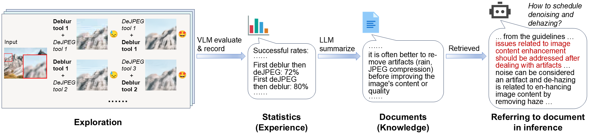
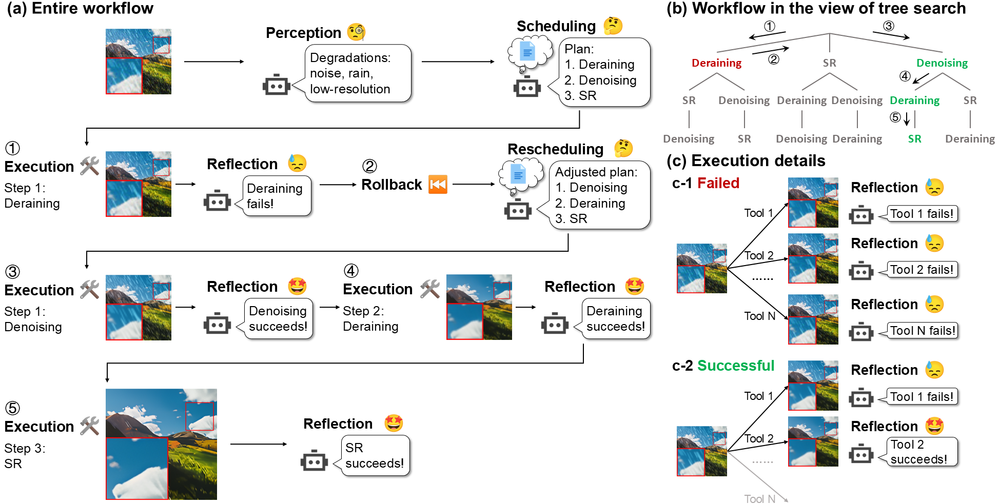
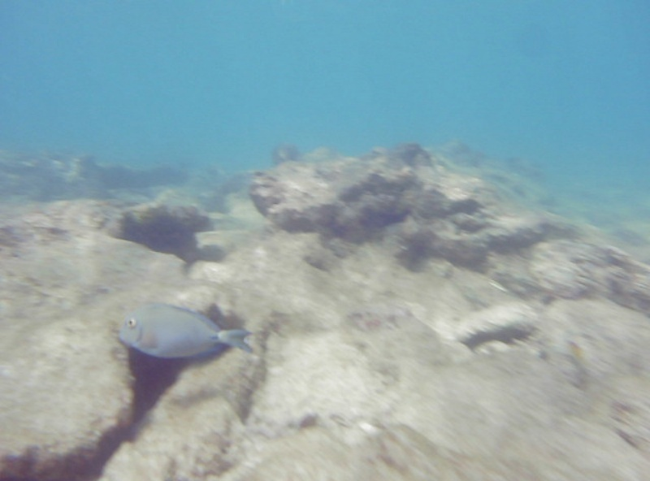
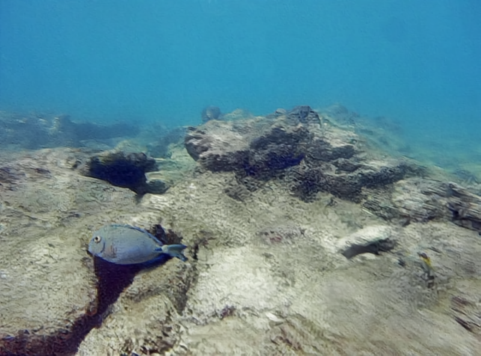
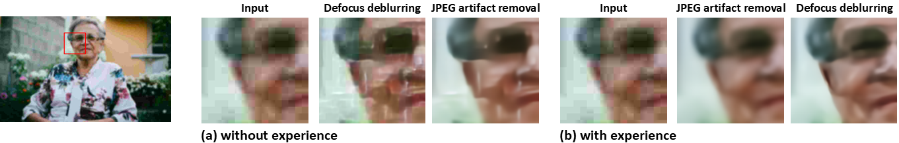
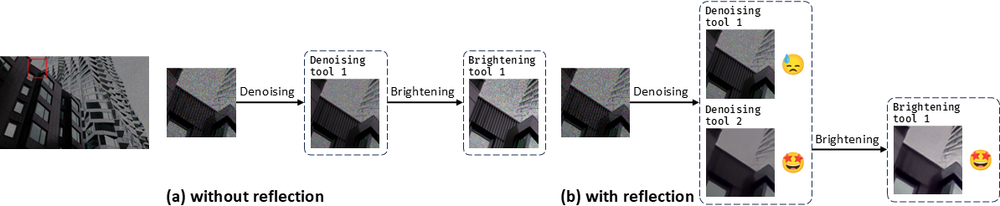
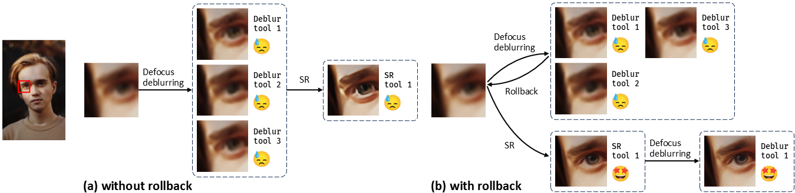

# An Intelligent Agentic System for Complex Image Restoration Problems
Kaiwen Zhu<sup>\*</sup>, [Jinjin Gu](https://www.jasongt.com/)<sup>\*</sup>, [Zhiyuan You](https://zhiyuanyou.github.io/), [Yu Qiao](https://scholar.google.com/citations?hl=en&user=gFtI-8QAAAAJ), [Chao Dong](http://xpixel.group/)

[Paper](https://arxiv.org/abs/2410.17809) | [Project Page](https://kaiwen-zhu.github.io/research/agenticir)


## Overview
### Learning from exploration



### Workflow


## Examples
### Restoration of real-world images
Restore a UDC image (from [this work](https://yzhouas.github.io/projects/UDC/udc.html)) by motion deblurring, defocus deblurring, and low light enhancement.
<div>


</div>

Restore an underwater image (from [this work](https://ieeexplore.ieee.org/document/9001231)) by defocus deblurring, dehazing, and motion deblurring.
<div>


</div>

### Effectiveness of planning with experience


### Effectiveness of workflow designs




## Installation
Please refer to [INSTALL.md](installation/INSTALL.md).

## Usage
### Setup
+ Fill in the API key in `config.yml`.
+ Run `python src/app_eval.py` and `python src/app_comp.py` in the directory `DepictQA`.

### Data preparation
To generate complexly degraded images, run `python -m dataset.synthesize`. You should place clean images in `dataset/HQ/` and corresponding depth maps in `dataset/depth/`. In the paper we use the [MiO100](https://github.com/Xiangtaokong/MiOIR?tab=readme-ov-file#setp-2-download-the-testsets) dataset. The degradation combinations are listed in `dataset/degradations.txt`. You can customize combinations in `dataset/degradations.txt` or degradation types in `dataset/add_single_degradation.py`.

### Learning
To let the agent learn from exploration, run 
+ `python -m exploration.exhaust_seq` to generate images to explore;
+ `python -m exploration.explore` to accumulate experience by evaluating images;
+ `python -m exploration.distill` to summarize the experience and distill knowledge.

### Inference
Run `python -m pipeline.infer` to restore an image (path specified in `pipeline/infer.py`).

## BibTex
```
@misc{agenticir,
      title={An Intelligent Agentic System for Complex Image Restoration Problems}, 
      author={Kaiwen Zhu and Jinjin Gu and Zhiyuan You and Yu Qiao and Chao Dong},
      year={2024},
      eprint={2410.17809},
      archivePrefix={arXiv},
      primaryClass={cs.CV},
      url={https://arxiv.org/abs/2410.17809}, 
}
```